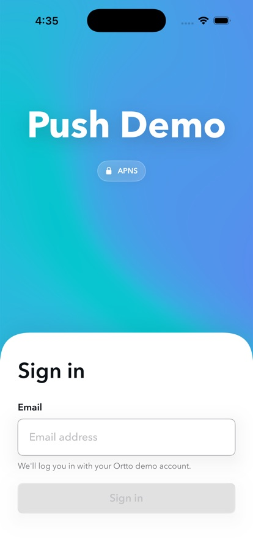
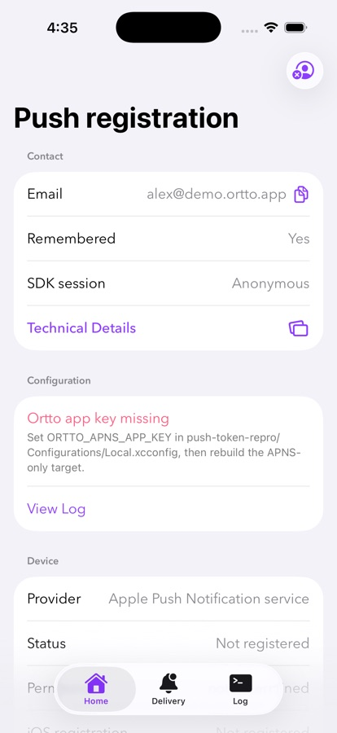
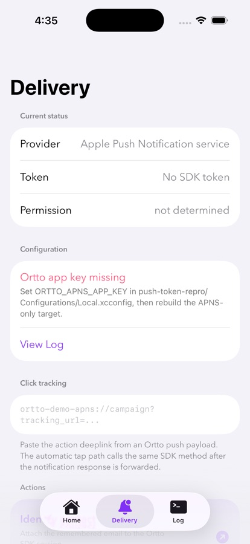
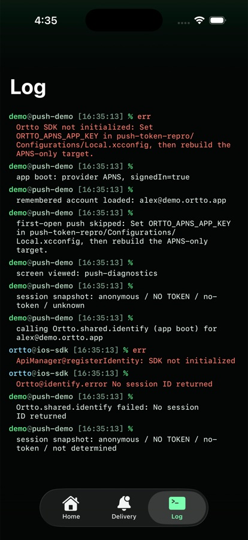

<div align="center">

# Ortto iOS SDK Push Demo

**A reference integration for the [Ortto iOS SDK](https://help.ortto.com/a-254-push-notifications-sdk-for-ios).**

Push permissions · token registration · session identity · link-click tracking · in-app notifications

[](https://developer.apple.com/ios/)
[](https://swift.org)
[](https://developer.apple.com/xcode/)
[](https://developer.apple.com/documentation/swiftui)

</div>

## Screenshots

| Login | Home | Delivery | Log |
| :---: | :---: | :---: | :---: |
|  |  |  |  |

## Contents

- [Screenshots](#screenshots)
- [Quick start](#quick-start)
- [Choosing a target](#choosing-a-target-apns-vs-fcm)
- [What it demonstrates](#what-it-demonstrates)
- [In-app notifications](#in-app-notifications-widgets)
- [Configuration](#configuration)
- [Project layout](#project-layout)
- [Test flow](#test-flow)
- [Troubleshooting](#troubleshooting)

## Quick start

> **Prerequisites**
> - Xcode 15.4+
> - An Ortto account and app key. 
> - For FCM, a Firebase project + `GoogleService-Info.plist`.

```sh
# 1. The demo lives in the SDK repo under Demo/ — work from there
cd Demo

# 2. Create your local config from the template (gitignored; your keys stay local)
cp PushDemo/Support/OrttoEnvironment.sample.swift \
   PushDemo/Support/OrttoEnvironment.swift
```

```sh
# 3. Open the workspace
open PushDemo.xcworkspace
```

**4.** Fill in `PushDemo/Support/OrttoEnvironment.swift` (see [Configuration](#configuration)).

**5.** Pick the scheme for your provider — `PushDemo-APNS` or `PushDemo-FCM` — and run.

> Push **delivery** requires a physical device and an Ortto push setup. The simulator is fine for permission, registration, identity, and widget flows.

## Choosing a target (APNS vs FCM)

Both targets share the SwiftUI shell but compile their own `AppDelegate` and `Info.plist`, so the install-time package choice stays visible without duplicating UI.

| | `PushDemo-APNS` | `PushDemo-FCM` |
| --- | --- | --- |
| **Links** | `OrttoPushMessagingAPNS` | `OrttoPushMessagingFCM` + Firebase Messaging |
| **Token source** | iOS APNS device token | Firebase registration token (APNS token bridged in) |
| **Forwarded via** | `PushMessaging.shared.registerDeviceToken(apnsToken:)` | `PushMessaging.shared.messaging(_:didReceiveRegistrationToken:)` |
| **Needs `GoogleService-Info.plist`** | No | Yes |

The shared `NotificationServiceExtension` links `OrttoPushMessaging` directly — rich-push interception is identical for both providers.

## What it demonstrates

Each item is one or two direct SDK calls at the call site:

- **Initialize** — `Ortto.initialize(appKey:endpoint:)` in `App/PushDemoApp.swift`.
- **Identify a contact** — `Ortto.shared.identify(...)` / `clearIdentity()` on sign in/out.
- **Track screen views** — `Ortto.shared.screen(_:)` from each tab's `onAppear`.
- **Register a push token** — forwarded from the target's `AppDelegate` (see table above).
- **Rich push (media)** — `MessagingService.shared.didReceive` in the notification service extension.
- **Notification taps** — `PushMessaging.shared.userNotificationCenter(...)` in `App/NotificationCallbacks.swift`.
- **Click tracking** — `Ortto.shared.trackLinkClick(_:)` from a tapped action deeplink, and from a Delivery action where you paste a tracked `tracking_url` deeplink directly.

> The app entry file (`PushDemoApp.swift`) is the map: each touchpoint is marked with an `// Ortto SDK:` comment.

## In-app notifications (widgets)

Delivered through the `OrttoInAppNotifications` package. The SDK owns the WebView overlay, fetch, queueing, and dismissal — the app just initializes capture and asks for a widget:

- **Init** — `OrttoCapture.initialize(dataSourceKey:captureJsURL:apiHost:)` at startup, only when `OrttoEnvironment.captureJsURL` is set (so the app stays push-only by default).
- **Auto-trigger** — `Ortto.shared.screen(_:)`, already sent per tab, shows any widget configured for that screen.
- **Manual** — the Delivery tab's **Load widgets** action lists the account's widgets so you can pick one; a manual widget-ID field is also available. Both call `OrttoCapture.shared.showWidget(_:)`.

> The SDK keeps its widget-fetch types internal, so **Load widgets** calls `/-/widgets/get` directly (against the configured `apiEndpoint`) and keeps only `popup` widgets — the only type `showWidget` renders.

## Configuration

Config lives in **`PushDemo/Support/OrttoEnvironment.swift`** — a plain Swift file you copy from `OrttoEnvironment.sample.swift` and fill in. It's gitignored, so your keys stay off version control.

| Field | Required | Description |
| --- | --- | --- |
| `apiEndpoint` | ✅ | Your account's capture endpoint for your region (AU/EU/US) or instance. |
| `apnsAppKey` | APNS target | APNS app key. |
| `fcmAppKey` | FCM target | FCM app key. |
| `captureJsURL` | optional | Account-specific capture JS URL. Set to enable in-app notifications. |

```swift
enum OrttoEnvironment {
    static let apiEndpoint = "https://capture-api-au.ortto.app/"
    static let apnsAppKey = ""
    static let fcmAppKey = "your-fcm-app-key"
    static let captureJsURL = ""
}
```

`AppConfiguration` picks `apnsAppKey` or `fcmAppKey` automatically based on the running target — no `//`-escaping or build-setting plumbing. For the **FCM** target, also drop a real Firebase plist at `PushDemo/GoogleService-Info.plist` (bundled only when present). Both `OrttoEnvironment.swift` and `GoogleService-Info.plist` are gitignored — never commit them.

## Project layout

```text
PushDemo/
├── App/             Entry point (@main) and target-specific app delegates
├── Models/          Provider enum, persisted demo state, UI model types
├── Support/         Ortto config (OrttoEnvironment) and the shared logger
├── ViewModels/      PushViewModel: demo state, SDK flows, derived status copy
├── Views/
│   ├── RootView     Shell: Login vs. Main based on sign-in state
│   ├── Login/       Login screen and its artwork
│   ├── Main/        Tabs — Home, Delivery, Log
│   └── Components/  Design system and shared controls
└── Configurations/  Per-target Info.plist and shared build settings
```

- Start at `App/PushDemoApp.swift` (`@main`).
- SDK calls are made inline where they happen — nothing is wrapped or hidden behind layers.
- `App/APNSAppDelegate.swift` / `FCMAppDelegate.swift` hold only the iOS-mandated token callbacks; Xcode compiles exactly one per target.

<details>
<summary><strong>Full file reference</strong></summary>

| File | Purpose |
| --- | --- |
| `App/PushDemoApp.swift` | App entry point (`@main`) and `Ortto.initialize` / `OrttoCapture.initialize`. |
| `App/APNSAppDelegate.swift` | APNS delegate: forwards the APNS device token to the SDK. |
| `App/FCMAppDelegate.swift` | FCM delegate: Firebase Messaging setup; forwards registration tokens to the SDK. |
| `App/NotificationCallbacks.swift` | Shared notification delegate; forwards taps to `PushMessaging.shared.userNotificationCenter(...)`. |
| `Models/PushProvider.swift` | APNS/FCM provider enum. |
| `Models/AppState.swift` | UserDefaults keys, buffered diagnostics state, log entry model. |
| `Models/UIModels.swift` | UI tabs, action status, toast, issue, and widget picker types. |
| `Support/AppConfiguration.swift` | Typed accessor over `OrttoEnvironment` + Firebase plist checks. |
| `Support/OrttoEnvironment.sample.swift` | Config template — copy to gitignored `OrttoEnvironment.swift`. |
| `Support/AppLog.swift` | Terminal-style log stream (`ortto@ios-sdk` + `demo@push-demo` entries). |
| `ViewModels/PushViewModel.swift` | Demo state object and UI plumbing. |
| `ViewModels/PushViewModel+Actions.swift` | The SDK flows — identify, register, redispatch, click tracking, widgets. |
| `ViewModels/PushViewModel+DerivedState.swift` | Derived registration status, validation issues, action labels. |
| `Views/RootView.swift` | App shell: Login vs. MainTabView, hosts the toast overlay. |
| `Views/Login/LoginView.swift` | Login screen; signing in identifies the email with the SDK. |
| `Views/Login/PaperShaderBackground.swift` | WebGL mesh-gradient backdrop ([Paper Shaders](https://github.com/paper-design/shaders)); SwiftUI gradient fallback. |
| `Views/Main/MainTabView.swift` | Signed-in tab controller (Home, Delivery, Log). |
| `Views/Main/HomeView.swift` | Contact, device, token, and configuration summary. |
| `Views/Main/DeliveryView.swift` | Registration actions, token override, click tracking, in-app notifications. |
| `Views/Main/LogView.swift` | Terminal-style console of SDK and demo log entries. |
| `Views/Main/TechnicalDetailsView.swift` | SDK, session, notification, and configuration checks. |
| `Views/Components/DesignSystem.swift` | Shared colors, typography, controls, icon treatment. |
| `Configurations/BuildDefaults.xcconfig` | Shared build settings (no Ortto config). |
| `Configurations/{APNS,FCM}/Info.plist` | Per-target config: app key, endpoint, URL scheme, background modes. |
| `GoogleService-Info.plist.example` | Shape of the Firebase plist; supply a real one for FCM. |
| `NotificationServiceExtension/NotificationService.swift` | Rich-push extension via shared `OrttoPushMessaging`. |

</details>

## Test flow

1. Install fresh or clear app data for a clean run.
2. Let the first-open push permission request run before login.
3. Sign in with an email address.
4. Copy the support summary from **Home** if support needs the current state.
5. Open **Delivery** and register the selected target's APNS or FCM token.
6. Use **Redispatch cached token** to observe SDK token/session de-dupe in the **Log**.
7. Paste a tracked push-action deeplink and run **Track link click**.
8. (Widgets) Set `captureJsURL` in `OrttoEnvironment.swift`, then **Load widgets** and show one.
9. Send a real notification with an action deeplink and confirm the tap reaches the SDK.
10. Sign out to run the flow again.

Build both schemes from the command line:

```sh
xcodebuild -workspace PushDemo.xcworkspace \
  -scheme PushDemo-APNS \
  -destination 'generic/platform=iOS Simulator' build

xcodebuild -workspace PushDemo.xcworkspace \
  -scheme PushDemo-FCM \
  -destination 'generic/platform=iOS Simulator' build
```

## Troubleshooting

| Symptom | Likely cause |
| --- | --- |
| App logs **"configuration missing"** / no SDK init | `OrttoEnvironment.swift` values are still empty/placeholder. Fill them in and rebuild. |
| Build fails: cannot find `OrttoEnvironment` | You haven't created `OrttoEnvironment.swift` yet — copy it from `OrttoEnvironment.sample.swift`. |
| Endpoint or key changes ignored | You edited `OrttoEnvironment.sample.swift` (the template, not compiled) instead of `OrttoEnvironment.swift`. |
| FCM token never arrives | `GoogleService-Info.plist` is missing from the app target. |
| **Load widgets** returns empty | No active session (sign in first), or the app key/endpoint belong to a different region/instance. |

---

<div align="center">
<sub>Part of the Ortto iOS SDK — covered by the SDK's license.</sub>
</div>
